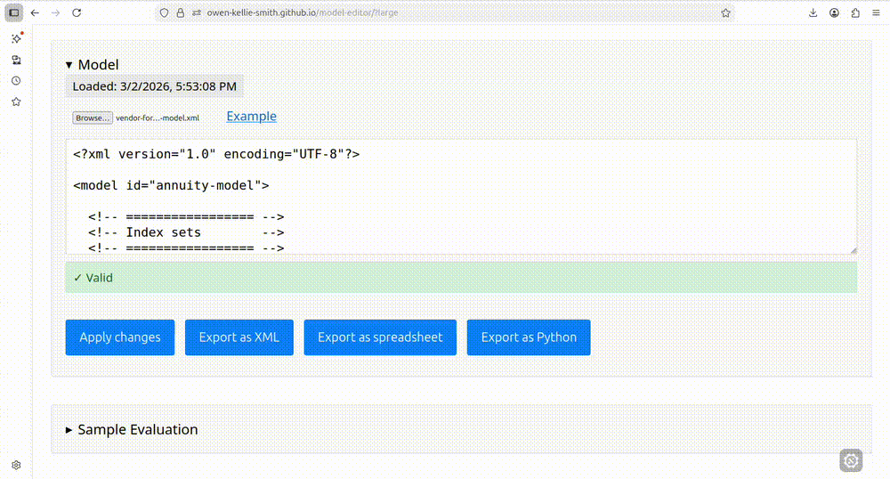

# model-editor


**Live demo:** https://owen-kellie-smith.github.io/model-editor/

---

Single webpage model-editor with validation, dependency derivation, and executable export.


[](./docs/examples/annuity-model/demo/video)


---

## How to run

### Browser UI

1. Clone or download the repository
2. From the repository root, serve locally:

```bash
python3 -m http.server 8080
```

then visit http://localhost:8080

3. Load or paste a `language.xml` (e.g. from the Example link) which lists functions (reserved words) in your modelling language.
4. Load or paste a `model.xml` (e.g. from the [examples folder](docs/examples))
5. Inspect Sample Evaluation which is a rendering of the model with sample inputs made up by the editor.
6. Inspect the graph of variable dependencies.
7. Edit variables (individually or in the main Model textarea) and see how your edits change the Sample Evaluation etc.
8. Export as spreadsheet (which adds sample inputs that you can change in your spreadsheet editor).
9. Export as Python. [Run the Python script](docs/examples/python) possibly with [actual inputs to replace the sample inputs](docs/examples/annuity-model/demo).

### CLI

Install dependencies and run the command-line tool directly:

```bash
npm install
node ./src/cli/index.js validate docs/examples/restaurant-model/model.xml --language docs/examples/language.xml
node ./src/cli/index.js graph docs/examples/restaurant-model/model.xml --language docs/examples/language.xml --root PROFIT --depth 2
```

Or register the local executable and use the `model-editor` command:

```bash
npm install
npm link
model-editor validate docs/examples/restaurant-model/model.xml --language docs/examples/language.xml
```

---

## File Format Support

### What files can you read with the model-editor?

The model-editor reads **XML files only**:
- **Language files** (`language.xml`) - Define available functions and their arities
- **Model files** (`model.xml`) - Define variables, their relationships, and calculations

### What files can you write with the model-editor?

You can export:
- **XML files** (`.xml`) - Export language and model definitions
- **Excel spreadsheets** (`.xlsx`) - Render models as calculation-ready spreadsheets with multiple sheets, formulas, and sample data
- **Python scripts** (`.py`) - Render models as calculation-ready scripts which output a `.csv` file
- **SVG/PNG files** - Download dependency graphs as images

### Can the model-editor read spreadsheet files or Python scripts?

**No.** The "Render model" features are **one-way** 

---

## Technology Stack

- **JavaScript:** ES6+ modules running directly in the browser 
- **DOM Manipulation:** Vanilla JavaScript (no framework)
- **XML Processing:** `@xmldom/xmldom`, `xpath`
- **Graph Visualization:** Viz.js (DOT format rendering to SVG)
- **Spreadsheet Generation:** ExcelJS for creating Excel workbooks with formulas
- **Testing:** Vitest with jsdom for browser environment simulation
- **Deployment:** GitHub Pages (served from repository root via GitHub Actions workflow)

---

## Testing

Run the test suite:

```bash
npm install  # Install dev dependencies
npm test     # Run all tests with Vitest
```

All tests are located in the `tests/` directory and map to specific requirements (R1-R12 below).

---

## Requirements and Test Coverage

| ID | Requirement | Tested by | Which shows 
|----|-------------|-------------|-----------------|
| R1 | Reject invalid language definitions in import | `language.test.js::when XML has a function with no name, when XML has a function with non-numeric arity` | Errors are thrown when language functions are malformed
| R2 | Preserve semantic meaning across language import and export  | `language.test.js::when vendor format language is loaded and exported` | Inferred functions are identical after a round-trip
| R3 | Prevent use of undefined symbols in models | `model.test.js::rejects_unknown_symbol` | A "missing reference" error is thrown when a formula contains an unknown identifier 
| R4 | Prevent circular logic in the model | `model.test.js::when model contains a cycle` | An error is thrown when a formula requires its own value
| R5 | Reject duplicate model definitions  | `model.test.js::when model contains duplicate variable identifiers, when model contains duplicate index set identifiers` | An error is thrown when a model contains duplicate identifiers 
| R6 | Preserve semantic meaning across model import and export  | `model.test.js::round trip through serializer` | Model features are identical after a round-trip
| R7 | Calculate incoming variables from formulae | `model.test.js::when model contains incoming variables` | Variables that flow into a variable are exactly the non-functions in its formula
| R8 | Calculate outgoing variables from formulae | `model.test.js::when model contains outgoing variables` | Variables that each variable flows into are exactly those in whose formulae it appears |
| R9 | Visualize incoming and outgoing variables as graphs | `graphRelations.test.js::getRelations, getGraphOfRelations` | Graphs contain variables and edges within specified depth from a root variable |
| R10 | Implement CRUD operations for a single variable | `variableCrud.test.js::createVariable, readVariable, updateVariable, deleteVariable, validateVariableId, listVariables, Integration: Create, Read, Update, Delete workflow` | Variables can be created, read, updated, and deleted with proper validation (duplicates, undefined references, circular dependencies, dependencies blocking deletion); full CRUD workflow maintains model validity 
| R11 | Render model in Excel format with sample inputs to enable quick manual verification of model structure | `spreadsheetDiagnosticsIntegration.test.js::should include diagnostics in README sheet for legacy annuity model, should work with vendor format model without diagnostics issues`; `spreadsheetFormula.test.js::should handle models with cohort-only variables, should handle simple model with function calls, should handle step-only variables`; `tableLookupFormula.test.js::should generate correct INDEX/MATCH formula with dynamic ranges`; `recursiveFormula.test.js::should handle recursive functions with step - 1 offset correctly, should handle recursive functions with step - 2 offset correctly, should handle multiple recursive references`; `cohortStepCopyable.test.js::should generate copyable step column, should maintain correct step references`; `constraintAwareSampleData.test.js::should extract columnOf constraints, should generate sample data respecting constraints`; `dynamicTableGeneration.test.js::should extract table definitions, should dynamically generate columns`; `tableDimensionsConstants.test.js::should have correct maxRow calculations`; `legacyModel.test.js::should use uppercase cell references in Excel formulas`; `manualVerification.test.js::should display expected sample data structure` | Spreadsheets are successfully rendered with: (1) working Excel formulas converted from model expressions, (2) proper cell references in dependency order, (3) sample input data respecting table constraints, (4) INDEX/MATCH formulas for table lookups with dynamic ranges, (5) recursive formulas with correct row offsets for time-dependent calculations, (6) copyable step columns that auto-increment, (7) diagnostics sheet documenting custom functions and temporal parameters, (8) uppercase cell references compatible with LibreOffice Calc, (9) multiple sheets for different variable types (cohort-only, step-only, cohort-step), (10) dynamically generated table columns based on variable references   
| R12 | Render model as a Python script with sample inputs that may be overriden by attaching other inputs at runtime | `pythonExport.test.js::renders and runs for all example models` | Python export produces a non-empty .csv file for each of the example models


### UI prototype
- Single-page, no-build browser UI
- Load XML via file input or pasted text
- Immediate feedback with contextual error reporting

---

## Architecture

The repository is organised around a reusable model engine. The browser UI and the CLI both sit on top of the same core modules.

## Project Structure

```
index.html              # Main UI entry point (served from repo root)
src/                    # All application source code
  core/                 # Core business logic (model, language, renderers, etc.)
  utils/                # Shared utilities (helpers, logger, formatters, etc.)
  browser/              # Browser-specific app code
    applications/       # Feature modules (language, model, graph, CRUD)
  cli/                  # CLI entry point
    index.js            # model-editor command-line tool
  config.js             # Application configuration (log level, etc.)
docs/                   # Static assets
  styles/               # CSS files
  examples/             # Sample XML files
tests/                  # Vitest test suite
  fixtures/             # Test data
  helpers/              # Test utilities
```

## Deploying to GitHub Pages

The repository includes a ready-made GitHub Actions workflow (`.github/workflows/pages.yml`) that deploys the app on every push to `main`. To enable it on your fork:

1. Go to your repository on GitHub → **Settings** → **Pages**
2. Under **Build and deployment**, set **Source** to **GitHub Actions**
3. Push to `main` (or click **Actions → Deploy to GitHub Pages → Run workflow**)

The workflow uploads the entire repository root as the Pages artifact, so `index.html`, `src/`, and `docs/examples/` are all served at their natural paths.

---

## Model Features

### Variable Definition Types

The model editor supports multiple definition types for variables:

- **expression** - Mathematical formula using other variables and functions
- **constant** - Simple constant
- **table** - Array of values indexed by position
- **tableLookup** - Value lookup from a table using an index
- **piecewise** - Conditional definitions with multiple branches

### Parameterized Variables

Variables can accept arguments (index sets) for multi-dimensional modeling:
```xml
<variable name="benefit" arguments="ageGroup,year">
  <definition type="expression">premium(ageGroup) * factor(year)</definition>
</variable>
```

### Time-shift References

Formulas can reference variables at different time steps:
```xml
<variable name="cashflow">
  <definition type="expression">balance(step-1) * rate</definition>
</variable>
```


---

## Troubleshooting

### Common Issues

**"Cannot load file" error:**
- Ensure you're serving files via HTTP (not file:// protocol)
- Check browser console for CORS or network errors

**"Invalid XML" error:**
- Validate XML syntax (all tags properly closed)
- Check for special characters that need escaping (&lt;, &gt;, &amp;)

**"Circular reference" error:**
- Review dependency graph to identify the cycle
- Variables are not allowed to depend on themselves directly or indirectly

**Tests fail:**
- Run `npm install` to ensure dev dependencies are installed
- Check that Node.js version is recent (ES6+ modules required)

---

## Contributing

1. Fork the repository
2. Create a feature branch
3. Make your changes
4. Add tests for new functionality
5. Ensure all tests pass with `npm test`
6. Submit a pull request

---

## License

MIT

---

## Authors

See GitHub contributors for the list of contributors to this project.

