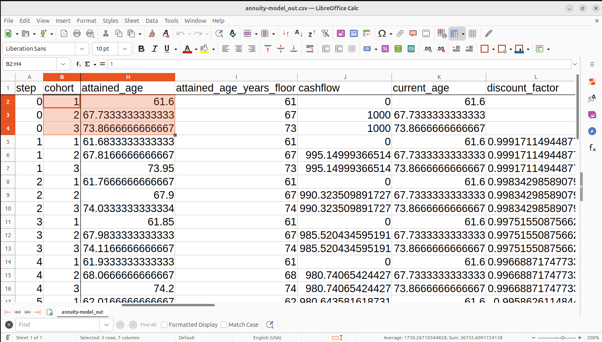
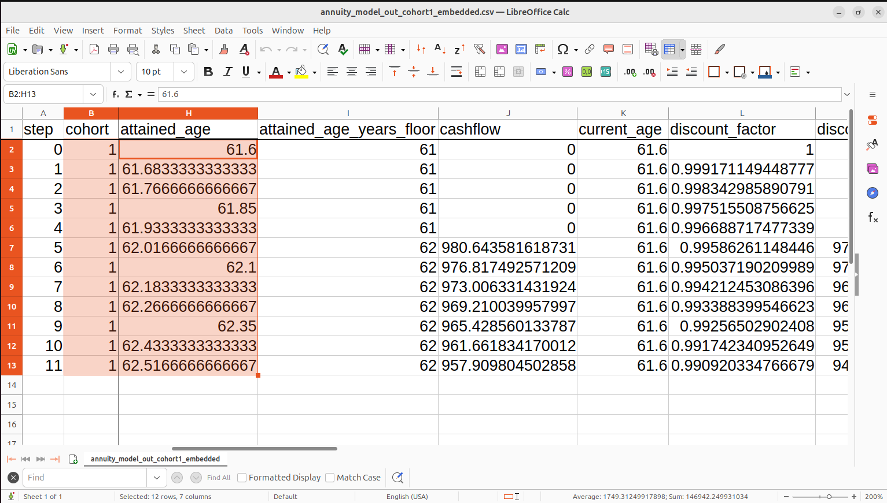

# Python scripts

1. [Load an XML model](../../../README.md#how-to-run)

2. Export as Python, which creates, say model.py in your Downloads folder. From the command line in your Downloads folder see what command line arguments are available in the Python script 
```bash
python3 model.py --help
```
## Example Python command lines and output
### Run with embedded sample inputs (referring to no other files)
#### Running all cohorts and sending output to standard filenames
`python3 annuity-model.py`


#### Running first cohort only and specifying output filename
`python3 annuity-model.py --index cohort=1 --csv annuity_model_out_cohort1_embedded.csv`


### Run with actual inputs
See [annuity model demo](../annuity-model/demo).


### Static chart (Lorenz)

`python3 lorenz.py --steps 60000 --plot-static --plot-vars "lorenz:x,y,z" --gif lorenz60000_static.gif`


### Animated chart (spacecraft)

`python3 rocket_with_thrust.py   --steps 60000   --plot-traj   --plot-vars "rocket:x,y;moon:moon_x,moon_y"   --plot-t tau   --plot-title day --plot-head-colors "rocket=red,moon=silver" --plot-tail-colors "rocket=blue,moon=dimgray"  --plot-step 10   --fps 30   --gif rocket60000.gif`


