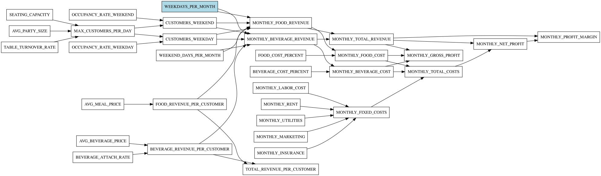
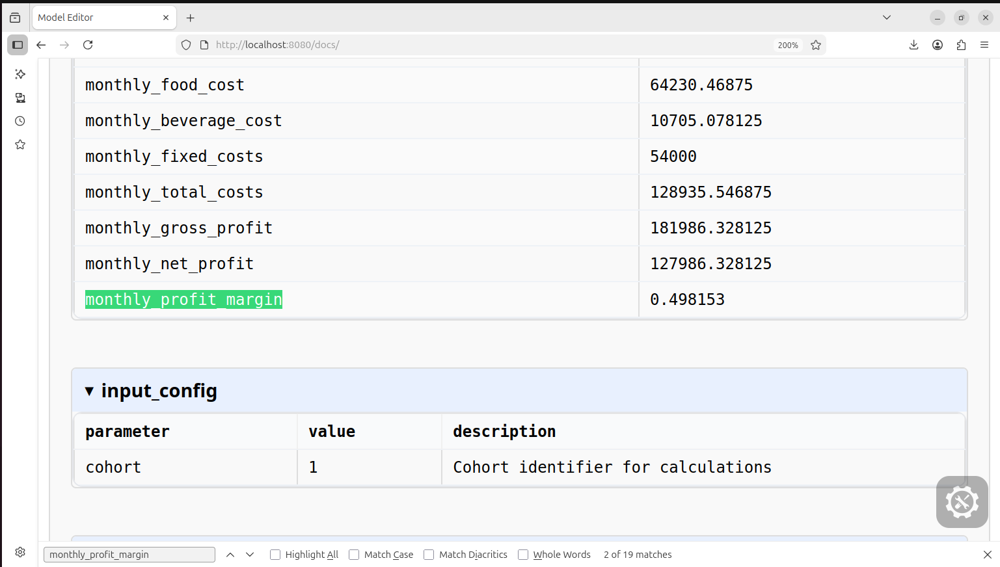
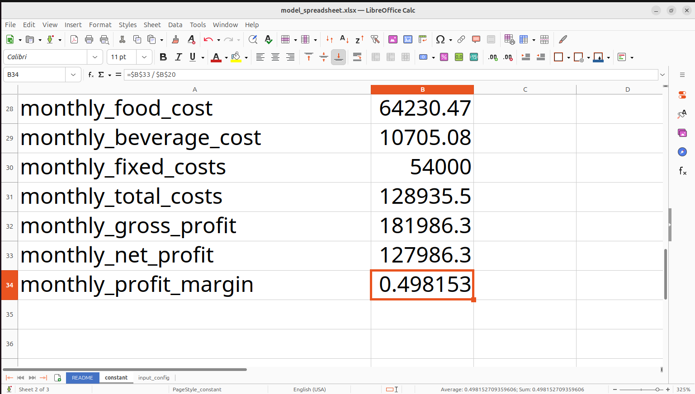
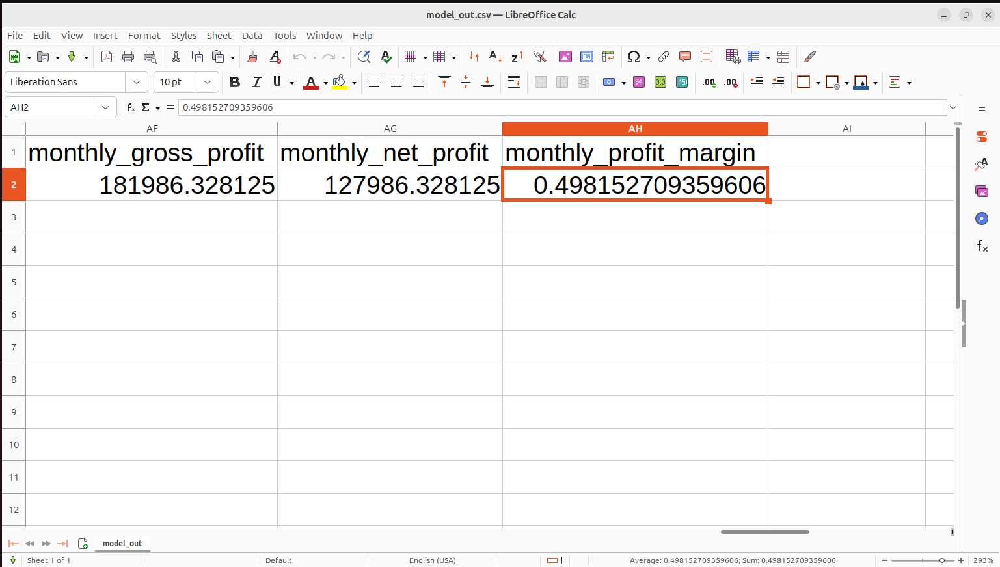

# Restaurant Profitability Model

This directory contains a **declarative financial model** for projecting restaurant profitability over time.

## Purpose

The model 
- demonstrates the model editor's capabilities with a real-world business domain
- provides a simple enough example to validate by hand.

## Model Description

This model projects the financial performance of a restaurant operation. It calculates revenue based on seating capacity, occupancy rates, and pricing, while accounting for variable costs (food, beverages) and fixed costs (labor, rent, utilities, marketing, insurance).

## Usage

See  [How to run](../../../README.md#how-to-run)

A graph of variable dependencies shows that MONTHLY_PROFIT_MARGIN is a far downstream variable so it is a good variable to use to check that all 3 renderings do equivalent calculations.  Also, the `restaurantNoIndices.xml` model is simple enough to roughly calculate MONTHLY_PROFIT_MARGIN by hand.

The margin is MONTHLY_NET_PROFIT / MONTHLY_TOTAL_REVENUE = (MONTHLY_TOTAL_REVENUE - MONTHLY_TOTAL_COSTS) / MONTHLY_TOTAL_REVENUE.

MONTHLY_TOTAL_REVENUE ~ $50 / customer * 150 customers / day * 30 days / month = $225,000 / month.
MONTHLY_TOTAL_COSTS = 54,000 fixed costs (MONTHLY_LABOR_COST + MONTHLY_RENT + MONTHLY_UTILITIES + MONTHLY_MARKETING + MONTHLY_INSURANCE, all fixed inputs)
 + ~ 30% * Food and drink revenue
 = 54,000 + 30% * 225,000
 = 121,500.
 
 So MONTHLY_PROFIT_MARGIN ~ (225,000 - 121,500) / 225,000
 ~ 103 / 225
 = 46%, which is a slight underestimate of the 49.815% calculated by each of 
 - the Sample Evaluation ,
 - the exported spreadsheet  and
 - the exported Python script 
 
 
