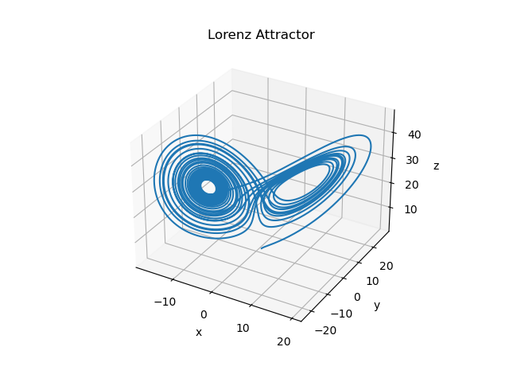

# Examples -- Non-linear dynamics

This folder contains non-financial example models demonstrating how the
declarative system can represent time-stepped dynamical systems.

The main example is a spacecraft orbiting Earth, optionally perturbed by
the Moon.

The second example is a numerical integration of the Lorenz Equations (1963).

These examples demonstrate that the declarative modelling system can
express nonlinear dynamics, indexed recursion, and adaptive stepping.

------------------------------------------------------------------------

# 1. Spacecraft orbiting Earth

Load [moon-rocket.xml](moon-rocket.xml) into the model-editor.

## 1. Stable Circular Orbit

### Try this

-   Set `mu_moon = 0`
-   Keep `altitude0 = 200`
-   Keep: `vy0 = (mu_earth / x0)^(1/2)`
-   Use `dt = 10`
-   Simulate \~6000 steps

### Expect to see

-   `altitude(t)` remains \~200 km
-   `radius(t)` remains nearly constant
-   `energy(t)` nearly constant
-   Plot `x` vs `y` → near-circle

------------------------------------------------------------------------

## 2. Make the Moon Disappear

### Try this

Set:

    mu_moon = 0

### Expect to see

-   Pure two-body motion
-   Conic-section orbit
-   Nearly constant energy

This is your numerical stability baseline.

------------------------------------------------------------------------

## 3. Turn the Moon Back On

Restore:

    mu_moon = 4902.800066

If using moving Moon, ensure `moon_x(t)` and `moon_y(t)` depend on
`tau(t)`.

### Expect to see

-   Slight orbital perturbations
-   Slow oscillations in altitude
-   Energy no longer strictly constant

------------------------------------------------------------------------

## 4. Raise Apogee (Simulate TLI)

### Try this

Increase initial tangential velocity:

    vy0 = 1.05 * (mu_earth / x0)^(1/2)

or

    vy0 = 1.10 * (mu_earth / x0)^(1/2)

### Expect to see

-   Elliptical orbit
-   Increasing apogee
-   `radius(t)` approaching lunar distance (\~384,000 km)

Plot: - `radius(t)` - `x` vs `y`

------------------------------------------------------------------------

## 5. Add Thrust

Example: thrust in +y direction for first 300 seconds.

Add to `ay`:

    + thrust_accel * (tau(t) < 300)

Define:

    thrust_accel = 0.001   (km/s^2)

### Expect to see

-   Increased apogee
-   Higher orbital energy
-   More eccentric orbit

------------------------------------------------------------------------

## 6. Adaptive Time Step

If using adaptive `dt(t)`:

### Try this

-   `dt_max = 30`
-   `dt_min = 1`
-   Adjust `dt_factor`

### Expect to see

-   Smaller timestep near Earth
-   Larger timestep far away
-   Efficient long transfers

Plot: - `dt(t)` - `tau(t)`

------------------------------------------------------------------------

## 7. What to Plot for Pictures

### Orbit picture

Plot: - X axis → `x` - Y axis → `y`

Optionally overlay: 
 - Earth as circle of radius `earth_radius` 
 - Moon orbit

### Energy diagnostics

Plot: - `energy` vs `tau`

Should be: - Flat (two-body) - Slowly varying (three-body)

------------------------------------------------------------------------

# 2. [Lorenz Equations (1963)](https://en.wikipedia.org/wiki/Lorenz_system)

Load [lorenz-difference.xml](lorenz-difference.xml) into the model-editor to integrate

## Equations

$$
\frac{dx}{dt} = \sigma (y - x)
$$

$$
\frac{dy}{dt} = x(\rho - z) - y
$$

$$
\frac{dz}{dt} = xy - \beta z
$$

with classic chaotic parameters

$$
\sigma = 10
$$

$$
\rho = 28
$$

$$
\beta = \frac{8}{3}
$$

Export to Python, add [plotting](#plotting) and run for 50000 steps i.e. in this case
`python3 ython3 lorenz_with_3d_plot.py --steps 50000`
 

------------------------------------------------------------------------

# :plotting:3. Plotting numerical output

I found it much quicker to generate the numerical results via the exported Python script than via the exported spreadsheet.
The exported Python script does not contain any plot command but you can manually add it.
For example, by loading [lorenz-difference.xml](lorenz-difference.xml), exporting its model.py Python script, and comparing that with [lorenz_with_3d_plot.py](lorenz_with_3d_plot.py) (which produced the graphic below) you can see that all that was added was
```
import matplotlib.pyplot as plt
from mpl_toolkits.mplot3d import Axes3D  
```
(near the top of model.py) and
```
        # ---- 3D Plot of x,y,z ----
        ts = list(range(0, TEMP_MAX + 1))

        xs, ys, zs = [], [], []
        for tval in ts:
            xs.append(CACHE.get(("x", (tval,)), float("nan")))
            ys.append(CACHE.get(("y", (tval,)), float("nan")))
            zs.append(CACHE.get(("z", (tval,)), float("nan")))

        # Filter out NaNs so matplotlib doesn't silently plot nothing
        pts = [(x, y, z) for x, y, z in zip(xs, ys, zs)
               if not (math.isnan(x) or math.isnan(y) or math.isnan(z))]

        if not pts:
            print("No finite (x,y,z) points found to plot. "
                  "Try running with --strict to see why values are NaN.")
        else:
            xs, ys, zs = zip(*pts)

            fig = plt.figure()
            ax = fig.add_subplot(111, projection="3d")
            ax.plot(xs, ys, zs)

            ax.set_xlabel("x")
            ax.set_ylabel("y")
            ax.set_zlabel("z")
            ax.set_title("Lorenz Attractor")
            plt.show()
```
(near the bottom)

------------------------------------------------------------------------


