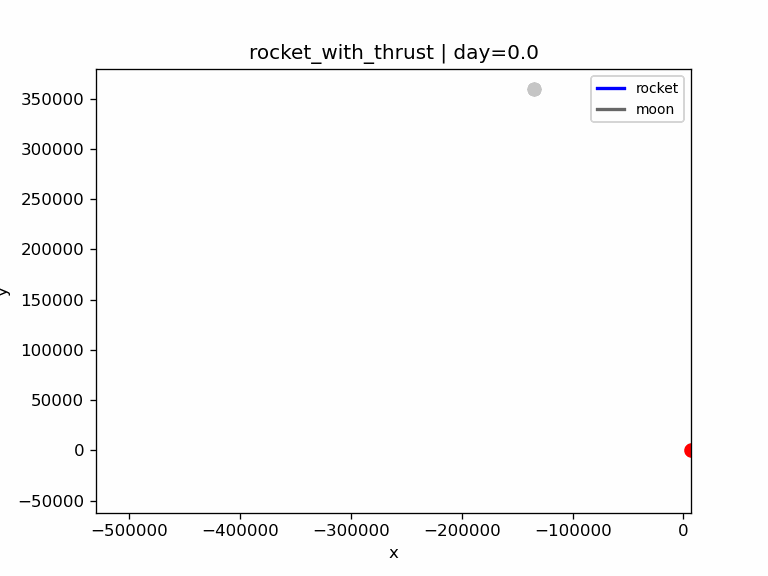
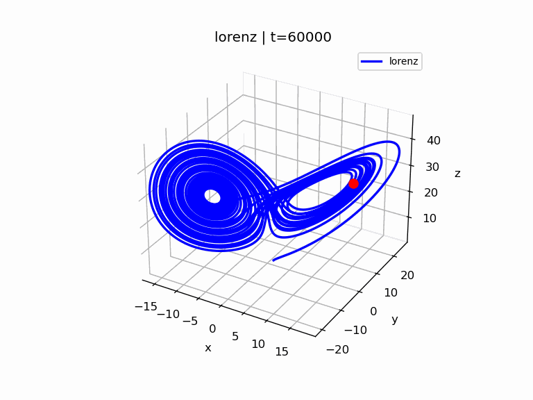

# Examples -- Non-linear dynamics

This folder contains non-financial example models demonstrating how the
declarative system can represent time-stepped dynamical systems.

The [first example](#spacecraft) models a spacecraft orbiting Earth, perturbed by
the Moon. Thrust controls represent an optional TLI in order to attempt to achieve low lunar orbit.

The [second example](#2-lorenz-equations-1963) is a numerical integration of the [Lorenz Equations (1963)](https://en.wikipedia.org/wiki/Lorenz_system).

These examples demonstrate that the declarative modelling system can
express nonlinear dynamics, indexed recursion, and [adaptive stepping](#adaptive-timestep).

------------------------------------------------------------------------

# Spacecraft

Using [rocket_with_thrust.xml](rocket_with_thrust.xml) 

This model implements a **planar circular restricted three-body problem with thrust**.

- Earth is static.
- Moon moves in circular orbits about Earth.
- The spacecraft's mass is negligible - it does not affect Earth or Moon.
- All motion is planar (2D).
- The spacecraft can accelerate in any direction.

---
## Constants (Mapped to XML)

### Physical Constants

| Physical meaning | Symbol | XML variable | Value | Units |
|---|---|---|---|---|
| Earth gravitational parameter | $$\mu$$ | `mu_earth` | 398600.4418 | km^3/s^2 |
| Moon gravitational parameter | $$\nu$$ | `mu_moon` | 4902.800066 | km^3/s^2 |
| Earth radius | $$\rho$$ | `earth_radius` | 6378 | km |
| Moon radius | $$\sigma$$ | `moon_radius` | 1737.4 | km |
| Moon orbital radius | $$\lambda$$ | `moon_orbit_radius` | 384400 | km |
| Moon orbital period | $$\tau$$ | `moon_period_s` | 2360591.51 | s |

### Initial conditions assumed 

| Meaning | Symbol | XML Variable | Value | Units |
|---|---|---|---|---|
| Initial Moon phase angle | $$P$$  | `moon_phase0` | 1.93 | rad   |
| Initial height of spacecraft above surface of Earth  | $$H$$  | `x0` | 200 | km  |
| Initial speed of spacecraft (for circular orbit of Earth) | $$\sqrt{\frac{\mu}{\rho + H}}$$  | `vy0` | 1.93 | km^3/s^2  |

### Spacecraft Control Constants for Trans Lunar Injection (TLI) 

| Meaning | Symbol | XML Variable | Value | Units |
|---|---|---|---|---|
| TLI acceleration magnitude | $$L$$ | `tli_accel` | 0.0025 | km/s^2 |
| TLI burn duration | $$B$$ | `tli_burn_s` | 1400 | s |
| TLI required nearness to perigee | $$E$$ | `perigee_gate_factor` | 1.05 | --- |

### Spacecraft Control Constants for Lunar Orbit Insertion (LOI) 

| Meaning | Symbol | XML Variable | Value | Units |
|---|---|---|---|---|
| Target orbit altitude | $$A$$ | `orbit_altitude_target` | 100 | km |
| Velocity gain | $$Y$$ | `loi_gain` | 0.0025 | — |
| Radial gain | $$R$$ | `loi_radial_gain` | 0.00001 | — |
| Maximum LOI acceleration | $$X$$ | `loi_accel_max` | 0.004 | km/s^2 |
| LOI trigger distance | $$G$$ | `loi_trigger_dist` | 300000 | km |

### Spacecraft Control Constants for Crash Avoidance 

| Meaning | Symbol | XML Variable | Value | Units |
|---|---|---|---|---|
| Safe altitude above Moon | $$S$$ | `moon_safe_altitude` | 500 | km |
| Avoidance acceleration magnitude | $$V$$ | `moon_avoid_accel` | 0.05 | km/s^2 |

---
## State Definition

Spacecraft position (Earth-centred inertial frame):

$$
\boldsymbol r(t) = \begin{bmatrix}
x(t) \\ 
y(t)
\end{bmatrix}
$$

Spacecraft Velocity:

$$
\boldsymbol v(t) = \dot{\boldsymbol r}(t)
$$

Spacecraft Distance to Earth:

$$
d_E(t) = \|\boldsymbol r(t)\|
$$

Moon phase:

$$
\theta(t) = P + \frac{2\pi}{\tau} t
$$

Moon position (circular orbit of radius $\lambda$):

$$
\boldsymbol r_M(t) =
\lambda \begin{bmatrix}
 \cos(\theta(t)) \\
 \sin(\theta(t))
\end{bmatrix}
$$

Spacecraft distance to (centre of) Moon:

$$
d_M = \|\boldsymbol r - \boldsymbol r_M\|
$$

Safe distance from (centre of) Moon:

$$
d_S = \sigma + S
$$

---
## Continuous-Time Equations of Motion

Velocity:

$$
\boldsymbol v = \dot{\boldsymbol r}
$$

Acceleration:

$$
\dot{\boldsymbol v} = - \mu \frac{\boldsymbol r}{d_E^3} - \nu \frac{\boldsymbol r - \boldsymbol r_M}{d_M^3} + \boldsymbol a_T
$$

Interpretation:

- First term: Earth gravitational acceleration in direction of a unit vector from spacecraft to Earth  
- Second term: Moon gravitational acceleration in direction of a unit vector from spacecraft to Moon  
- Third term: Control-provided thrust acceleration  

## Thrust Definitions

The thrust acceleration $\boldsymbol a_T$ depends on control mode.
Three acceleration components are defined.
1. [Trans-Lunar Injection (TLI)](#trans-lunar-injection-tli)
2. [Lunar Orbit Insertion (LOI)](#lunar-orbit-insertion-loi)
3. [Moon Avoidance](#moon-avoidance)

The control system selects which thrust components are active:

- During the [TLI burn times](#tli-burn-times)  $\boldsymbol a_T = \boldsymbol a_{TLI}$.
- When the spacecraft is a [safe distance from moon surface](#moon-avoidance) but within LOI trigger distance $d_S < d_M < G$, then $\boldsymbol a_T = \boldsymbol a_{LOI}$.
- When the spacecraft is an [unsafe distance from moon surface](#moon-avoidance) $d_M < d_S$, then $\boldsymbol a_T = \boldsymbol a_{LOI} + \boldsymbol a_{avoid}$.
- Otherwise  $\boldsymbol a_T = 0$.

The thrust term is therefore a piecewise-defined control acceleration
superimposed on gravitational motion.

---

### Trans-Lunar Injection (TLI)

During the TLI burn times:

$$\boldsymbol a_{TLI} = L \frac{\boldsymbol v}{\|\boldsymbol v\|}$$

#### TLI burn times 

The TLI burn times are a series of intervals in the near-perigree parts of the orbit totalling $B$ s at most.  The required "nearness" to perigee is defined by $E$.

---

### Lunar Orbit Insertion (LOI)

#### Unit Radial Vector from Moon

The outward radial unit vector from the Moon to the spacecraft is:

$$
\hat{\boldsymbol u} =
\frac{\boldsymbol r - \boldsymbol r_M}{\|\boldsymbol r - \boldsymbol r_M\|} = \frac{\boldsymbol r - \boldsymbol r_M}{d_M}. 
$$

#### Relative Velocity (spacecraft relative to Moon)

Moon velocity relative to Earth (time derivative of Moon position):

$$
\dot{\boldsymbol r}_M =
\frac{2 \pi \lambda}{\tau}
\begin{bmatrix}
-\sin(\theta) \\
 \cos(\theta)
\end{bmatrix}
$$

Velocity of spacecraft relative to Moon:

$$
\boldsymbol v_{rel} =
\boldsymbol v - \dot{\boldsymbol r}_M
$$

#### Desired Circular Velocity around Moon

Target orbit radius:

$$
r_T = \sigma + A
$$

Required speed to maintain target circular orbit of Moon:

$$
v_c = \sqrt{\frac{\nu}{r_T}}
$$

Tangential unit vector in counter-clockwise direction of desired orbit:

$$
\hat{\boldsymbol t} =
\begin{bmatrix}
-\hat u_y \\
\hat u_x
\end{bmatrix}
$$

Target velocity:

$$
\boldsymbol v_{des} = v_c \hat{\boldsymbol t}
$$

Applied acceleration towards target velocity and orbit radius:
$$\boldsymbol a_{LOI} = Y (\boldsymbol v_{des} - \boldsymbol v_{rel}) + R (r_T - d_M) \hat{\boldsymbol u}$$

Acceleration is limited by:

$$
\|\boldsymbol a_{LOI}\| \le X
$$

---
### Moon Avoidance

Avoidance acceleration, when $d_M \lt d_S$

$$
\boldsymbol a_{avoid} = V \hat{\boldsymbol u}
$$

## Adaptive timestep

The model uses an adaptive timestep that is explicitly capped to small values during active TLI burns and whenever the spacecraft is within 75,000 km of the Moon, which is why the simulation visibly slows down near LOI.

## Running the rocket model

Load [rocket_with_thrust.xml](rocket_with_thrust.xml) into the model-editor.
Export to Python to output (to Downloads folder) `rocket_with_thrust.py`.

The animated .gif below was output by running in bash (in the Downloads folder) 

`python3 rocket_with_thrust.py   --steps 60000   --plot-traj   --plot-vars "rocket:x,y;moon:moon_x,moon_y"   --plot-t tau   --plot-title day --plot-head-colors "rocket=red,moon=silver" --plot-tail-colors "rocket=blue,moon=dimgray"  --plot-step 10   --fps 30   --gif rocket60000.gif`

------------------------------------------------------------------------

# 2. [Lorenz Equations (1963)](https://en.wikipedia.org/wiki/Lorenz_system)

Load [lorenz-difference.xml](lorenz-difference.xml) into the model-editor to integrate

## Equations

$$
\frac{dx}{dt} = \sigma (y - x)
$$

$$
\frac{dy}{dt} = x(\rho - z) - y
$$

$$
\frac{dz}{dt} = xy - \beta z
$$

with classic chaotic parameters

$$
\sigma = 10
$$

$$
\rho = 28
$$

$$
\beta = \frac{8}{3}
$$

Export to Python to output (to Downloads folder) `lorenz.py`.

The static .gif below was output by running in bash (in Downloads folder)

`python3 lorenz.py --steps 60000 --plot-static --plot-vars "lorenz:x,y,z" --gif lorenz60000_static.gif`

 

