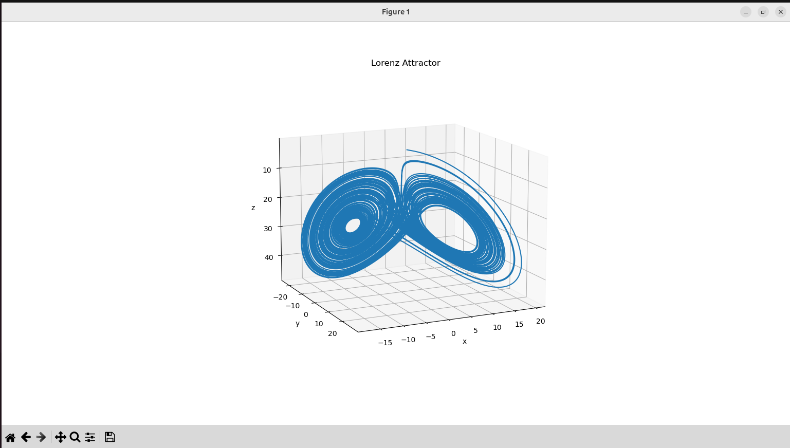

# Examples -- Orbital Mechanics Model

This folder contains a non-financial example model demonstrating how the
declarative system can represent time-stepped dynamical systems.

The main example is a spacecraft orbiting Earth, optionally perturbed by
the Moon.

------------------------------------------------------------------------

# 1. Stable Circular Orbit

## Try this

-   Set `mu_moon = 0`
-   Keep `altitude0 = 200`
-   Keep: `vy0 = (mu_earth / x0)^(1/2)`
-   Use `dt = 10`
-   Simulate \~6000 steps

## Expect to see

-   `altitude(t)` remains \~200 km
-   `radius(t)` remains nearly constant
-   `energy(t)` nearly constant
-   Plot `x` vs `y` → near-circle

------------------------------------------------------------------------

# 2. Make the Moon Disappear

## Try this

Set:

    mu_moon = 0

## Expect to see

-   Pure two-body motion
-   Conic-section orbit
-   Nearly constant energy

This is your numerical stability baseline.

------------------------------------------------------------------------

# 3. Turn the Moon Back On

Restore:

    mu_moon = 4902.800066

If using moving Moon, ensure `moon_x(t)` and `moon_y(t)` depend on
`tau(t)`.

## Expect to see

-   Slight orbital perturbations
-   Slow oscillations in altitude
-   Energy no longer strictly constant

------------------------------------------------------------------------

# 4. Raise Apogee (Simulate TLI)

## Try this

Increase initial tangential velocity:

    vy0 = 1.05 * (mu_earth / x0)^(1/2)

or

    vy0 = 1.10 * (mu_earth / x0)^(1/2)

## Expect to see

-   Elliptical orbit
-   Increasing apogee
-   `radius(t)` approaching lunar distance (\~384,000 km)

Plot: - `radius(t)` - `x` vs `y`

------------------------------------------------------------------------

# 5. Add Thrust

Example: thrust in +y direction for first 300 seconds.

Add to `ay`:

    + thrust_accel * (tau(t) < 300)

Define:

    thrust_accel = 0.001   (km/s^2)

## Expect to see

-   Increased apogee
-   Higher orbital energy
-   More eccentric orbit

------------------------------------------------------------------------

# 6. Adaptive Time Step

If using adaptive `dt(t)`:

## Try this

-   `dt_max = 30`
-   `dt_min = 1`
-   Adjust `dt_factor`

## Expect to see

-   Smaller timestep near Earth
-   Larger timestep far away
-   Efficient long transfers

Plot: - `dt(t)` - `tau(t)`

------------------------------------------------------------------------

# 7. What to Plot for Pictures

### Orbit picture

Plot: - X axis → `x` - Y axis → `y`

Optionally overlay: 
 - Earth as circle of radius `earth_radius` 
 - Moon orbit

### Energy diagnostics

Plot: - `energy` vs `tau`

Should be: - Flat (two-body) - Slowly varying (three-body)

------------------------------------------------------------------------

# 8. Numerical Method

This model uses Velocity-Verlet (Leapfrog) integration:

1.  Kick half-step velocity
2.  Drift position
3.  Recompute acceleration
4.  Kick half-step velocity

Advantages: - Second-order accuracy - Good energy behaviour - Suitable
for orbital mechanics

Caveats: - Very large dt injects energy - Variable dt weakens symplectic
properties

Rule of thumb: - LEO stable orbit → dt ≤ 10 s - Reduce dt if energy
drifts steadily

------------------------------------------------------------------------

# 9. Suggested Experiments

1.  Remove Moon → verify circular orbit.
2.  Increase velocity by 5% → elliptical orbit.
3.  Increase velocity by 41% → escape trajectory.
4.  Add thrust pulse → tune apogee to lunar distance.
5.  Increase dt → observe instability.
6.  Decrease dt → improved energy conservation.

------------------------------------------------------------------------

The second example is a numerical integration of the Lorenz Equations (1963)

------------------------------------------------------------------------

These examples demonstrate that the declarative modelling system can
express nonlinear dynamics, indexed recursion, and adaptive stepping.
